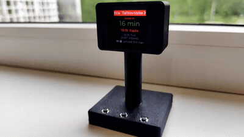

# Elron train display (nRF52840 + ST7789)

A little departure board: a Seeed XIAO nRF52840 drives a 240×240 ST7789 over SPI
and shows the next **Tallinn-Väike → Kohila** Elron trains (any route is
configurable) — specifically **when to start walking** to catch one. A companion app
(Windows/Linux/macOS) fetches a week of live times and pushes them over USB or BLE;
the board persists them to flash and runs offline on battery.



```
  ┌─────────────────────────┐
  │ Tallinn-Väike → Kohila  │   ← Elron-orange title bar
  │        leave in         │
  │        14 min           │   ← when to start walking (red ≤5 min / GO NOW)
  │      16:35  Viljandi    │   ← the train: time + final destination (⚡ = express)
  │      17:31  Viljandi    │
  │      18:18  Rapla       │   ← following departures
  │   ⧉ synced 1m ago       │
  └─────────────────────────┘
```

## Layout

- `boards/xiao_ble.overlay` — ST7789 on SPI3 + GPIO backlight; disables the board
  peripherals (`i2c1`/`spi2`/`uart0`) that otherwise squat on the display pins.
- `prj.conf`, `CMakeLists.txt`, `src/` — the Zephyr/NCS firmware.
- `src/buttons.c` — three front-panel buttons (debounced); one is a staged
  hold-to-reset / hold-longer-for-bootloader. See [Buttons](#buttons).
- `src/game.c` — "Catch the Train", a hidden one-button endless runner reachable
  with the #1+#2 chord. See [Buttons](#buttons).
- `companion/` — the cross-platform `uv` app (`elron_push.py`) that fetches live
  data and pushes it over USB/BLE. See `companion/README.md`.
- `build.sh` — builds (NCS v2.7.0) and flashes hands-free over BLE.
- `flash.ps1` — Windows helper that copies the UF2 onto the bootloader drive.

## Build & flash

```bash
./build.sh            # build + hands-free flash (BLE reboot -> copy UF2)
./build.sh --no-flash # just build
```
First-time bootstrap (before the BLE-reboot firmware is on the board): double-tap
RST and copy `build/zephyr/zephyr.uf2` onto the `XIAO-SENSE` drive (or run
`flash.ps1` on Windows). Toolchain: NCS **v2.7.0** via `nrfutil`, built inside the
toolchain bundle but with system git first on `PATH` (the bundled git is broken on
Ubuntu 24.04). The pin is deliberate — v2.7.0 still has the direct-SPI `st7789v`
binding the overlay uses; Zephyr 3.7+ replaced it with MIPI-DBI.

Once the firmware is running you can also enter the bootloader **without a PC or
the serial touch**: hold the reset/bootloader button ~6 s until the UF2 drive
mounts, then copy the `.uf2` onto it (see [Buttons](#buttons)).

## Run the companion (Windows / Linux / macOS)

Needs a real Bluetooth radio. USB push works the same on every OS — the board's
data port is `COMx` on Windows, `/dev/ttyACM*` on Linux/macOS.

```bash
cd companion
uv sync
uv run elron_push.py             # push a week of times once
uv run elron_push.py --serve     # stay running; auto-(re)send when the board appears
uv run elron_push.py --list-stations   # print every selectable station name
```

> Linux: if pushes over USB stall, ModemManager may be grabbing the port — mask it
> (`sudo systemctl mask ModemManager`) or rely on the BLE path.

## Configure the route

Any Elron station works, not just Tallinn-Väike → Kohila. Set them once in
`companion/elron-config.json` (CLI flags override per-run):

```json
{ "origin": "Tartu", "dest": "Tallinn", "walk_min": 15, "days": 7,
  "device_name": "Elron Display" }
```

Run `uv run elron_push.py --list-stations` to see all valid names (there are ~150);
a misspelled name suggests close matches. `walk_min` is your door-to-platform time
(drives the "leave in" countdown); `days` is how much schedule to preload.

**Autostart** so it always re-syncs the board:
- Windows: drop `companion/elron-service.vbs` into
  `%APPDATA%\Microsoft\Windows\Start Menu\Programs\Startup\`.
- Linux: install the systemd user unit `companion/elron-companion.service`
  (instructions are in the file header).

## Buttons

Three front-panel buttons on the XIAO header — D0/D1/D2 as inputs sharing a common
on D8 (the firmware drives it low; inputs use internal pull-ups), debounced in
`src/buttons.c`.

- **Reset / bootloader button** — a deliberately staged *hold*, so a tap does
  nothing (it can't be triggered by accident). An on-screen banner shows the stage
  as you hold:
  - hold ~3 s, release → **reset** (clean reboot; also re-syncs, since the clock
    is RAM-only)
  - keep holding to ~6 s, release → reboot into the **UF2 bootloader** — a
    hardware DFU trigger, so you can reflash without the 1200-baud serial touch
  - hold past 10 s → cancelled, nothing happens

  Thresholds live in `src/main.c` (`BTN3_RESET_MS` / `BTN3_BOOT_MS` /
  `BTN3_CANCEL_MS`).
- **Buttons #1 and #2** — normally unused on the schedule view; **hold both at
  once** to launch the hidden game, *"Catch the Train"* (a one-button endless
  runner, `src/game.c`). In the game, **#1 = GO** (start / jump / replay) and
  **#2 = BACK** (quit to the schedule). The high score persists in NVS; the
  game-over screen auto-exits after 20 s.

## How it works

- **Live data**: Elron's Ridango backend (`api.ridango.com`, region 64) — the same
  source as elron.pilet.ee, no API key. A week of departures as absolute Unix
  timestamps, so the board shows the right next train across days with no re-sync.
- **Walk time**: the board targets the soonest train you can still catch given your
  door-to-platform time (`--walk-min`, default 20) and shows the leave countdown.
- **Offline + resync**: the schedule persists in flash. On every boot the board
  advertises "needs sync" (its clock is RAM-only); the `--serve` companion sees that
  and re-pushes — so unplugging/reflashing just works.
- **BLE**: a small custom GATT service; chunked writes; the board drops idle/phantom
  connections so it never gets stuck, and re-advertises after every disconnect.
- **USB serial sync**: when plugged in, the companion pushes over USB instead of BLE
  (more reliable, and lets the board get the time without any BLE). The board exposes
  **two** CDC ports — one stays the log console, the other is a dedicated data channel.
  The companion finds the data port by pinging (it's the one that ACKs) and only counts
  the push as done once the board confirms it applied; otherwise it falls back to BLE.
- **Power (LiPo)**: solder a cell to the XIAO's BAT pads — it charges over USB and
  runs from the battery when unplugged, so the clock keeps going. Charge current is
  set in firmware via P0.13 (`CHARGE_CURRENT_MA` in `battery.c`, currently 100 mA;
  also supports 50 mA or off), and charging caps at ~90 %, resuming at ~50 % for
  longevity. The status line shows a rough **battery icon** (charging bolt on USB).
- **Overnight**: the screen blanks **23:00–09:00** (backlight off + panel off, fully
  reversible), and the main loop idles longer while it's off for low-power sleep —
  without dropping the clock or BLE.
- **Boot UX**: the clock is RAM-only, so after any power-up the board shows
  **"Waiting for sync"** until the companion pushes; then "synced Nm ago".
